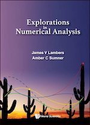

# COS 374 - Numerical Analysis
University of Southern Maine<br>
Department of Computer Science


## Course description

A study of the theory and application of computational algorithms for interpolation, equation solving, matrix methods, integration, and error analysis. Prerequisites: grades of C or better in COS 160, MAT 252, and MAT 295, or permission of instructor. Offered once every two years. Cr 3. COS 374 is a required elective for the Computer Science major (see all [requirements](https://catalog.usm.maine.edu/preview_program.php?catoid=13&poid=2601) for Computer Science).  
  
Numerical analysis studies the methods used to solve problems involving continuous variables and is an applied branch of mathematics and computer science. This numerical analysis course aims to provide students with opportunities to learn to devise, evaluate, and use methods for computing approximate but accurate solutions to various numerical problems that arise in mathematics, physics, biology, and data science. COS 374 covers the analysis of direct and indirect methods of solution of linear systems, with attention to generating and propagating numerical errors and computational speed. Matrix conditioning will be considered.  

### Prerequisites

Grade of C or higher in COS 160, MAT 252, and MAT 295, or permission of instructor.

## Learning Outcomes

By the end of this course, students will be able to:

*   Apply basic programming constructs to solve numerical problems
*   Show how numbers are represented on the computer and how errors from this representation affect arithmetic
*   Apply numerical methods for accurate solutions to scientific problems
*   Understand issues of algorithm complexity and programmability
*   Solve numerical linear algebra problems
*   Interpret machine output and provide a good understanding of the problems of error analysis and convergence of algorithms

## Textbook
<!-- 
|     |     |
| --- | --- |
-->
     Lambers et al., (2018). [Explorations in Numerical Analysis](https://doi.org/10.1142/10446). World Scientific. <!-- ISBN: 978-981-320-997-8.  -->

- - -

## Software

We will use [The Julia Programming Language](https://julialang.org) (Julia for short). Julia can be installed at the terminal (Linux/Mac) with the command:

```
curl -fsSL https://install.julialang.org | sh
```

I also recommend downloading [Octave](https://octave.org). If you do not wish to download and install either locally, both can be used in the cloud at [Cocalc.com](https://cocalc.com).  
  
A collection of mathematical software, papers, and databases maintained by Oak Ridge National Laboratory can be downloaded from [Netlib Repository](https://netlib.org), in particular, [LAPACK](https://www.netlib.org/lapack/), [LINPACK](https://netlib.org/linpack/), and [BLAS (Basic Linear Algebra Subprograms)](https://netlib.org/blas/) packages/libraries.

<!-- 
### Meetings

*   Lectures: Tue/Thur 9:30am - 10:45am ([Payson Smith 204](https://usm.maine.edu/about-our-university/wp-content/uploads/sites/581/2022/09/portland-campus-map.pdf))


### Communication

Please communicate through [Brightspace](https://courses.maine.edu/d2l/home/294508).
-->


### Grading

Grades will be based on attendance/participation, surveys/suggestions/errata, exploration/exercise assignments, a midterm, and a final exam with the following percentages:

*   10%: Attendance & Participation
*   30%: Surveys, Suggestions, Summaries, & Lists
*   50%: Exploration Exercises
*   10%: Final Exam

### Final Exam

The final examination will be an in-person, written, comprehensive examination. Per the registrar’s schedule, it will be given on Tuesday, April 30, from 8:00 a.m. to 10:00 a.m. in Payson Smith 204.

### LaTeX Template

Prepare assignments in (`.tex`) or Markdown (`.md`) and submit them through Brightspace under the associated assignment. You may use this [LaTeX template](https://cs.usm.maine.edu/~james.quinlan/latex/LaTeX-template.txt). One option to include code is the verbatim environment. For example,

```
\begin{verbatim}
for i = 1:10
  println(i)
end
\end{verbatim}
```


#### COS 574 (Graduate Students)

Graduate students taking the class for COS 574 credit are required to complete a project. The project will explore a numerical (linear algebra) topic in more depth. Projects should have sufficient complexity to merit graduate-level work. The project requires a computational component demonstrating proficiency in programming languages following coding best practices. The write-up should provide background concepts, motivating context, documentation of data sources, code, results, analysis, and conclusions. The report needs to be written in LATEX. Images contained in figures should be at least 300-600 dpi. The final project must be available on a GitHub repository, including all source code, test matrices, and LATEX. [List of project ideas.](https://cs.usm.maine.edu/~james.quinlan/cos374/cos574.pdf)

### Late policy

Unless otherwise noted, exercises/assignments will be due on Friday by 11:59 pm. Late submissions will **not** be accepted. In recognition of the fact that there may be unforeseen circumstances that prevent you from submitting some assignments, the two lowest assignment grades will be dropped. Surveys, Suggestions, Lists, & Erratas due dates vary, and notice will be given several days in advance.

### Tips for Success

*   attend all class meetings
*   read the material before coming to class
*   complete assignments by the due dates specified
*   create a study and/or assignment schedule to stay on track
*   read announcements
*   communicate regularly with your instructor and peers
*   read and respond to course email messages as needed
*   utilize [USM's Online Student Support Services](https://catalog.usm.maine.edu/content.php?catoid=3&navoid=90)
*   turn off your cellphone

### Classroom Policies

1.  No cellphones
2.  Bring a laptop (but only use it when coding) AND the textbook
3.  No AI (you are not learning if copilot codes for you)
